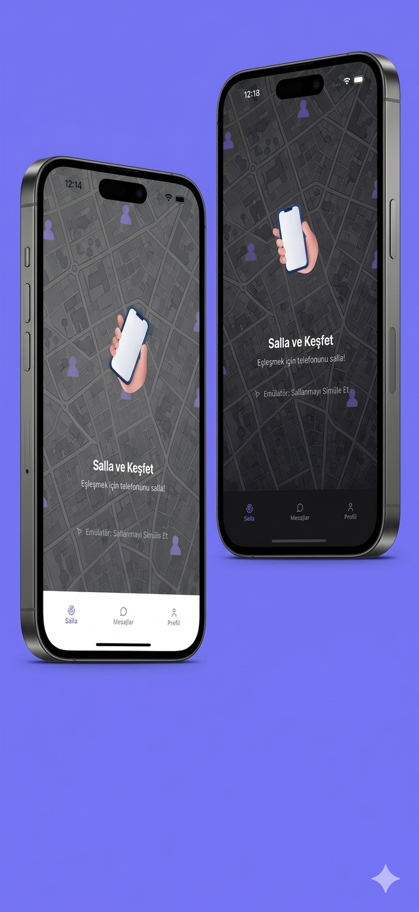
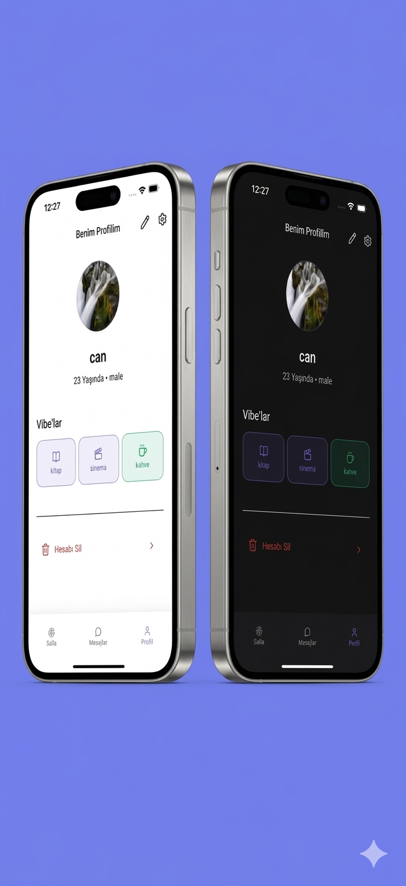
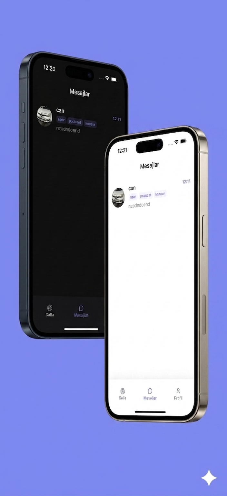

# Shakr 📳🤝

> Shake your phone, meet people near you.
> Telefonunu salla, etrafındaki insanlarla anında eşleş.

Shakr is a mobile social-discovery app: users **shake their phone** to broadcast a "I'm available to meet" signal. The app then matches them in real time with another nearby user who shook at (almost) the same moment, opening a temporary chat so the two can decide whether to connect.

Built as a portfolio project with **Flutter + Firebase**, following **Clean Architecture** and a **Cubit/BLoC** state-management approach.

---

## 📑 Table of Contents

- [English](#overview-)
- [Türkçe](#genel-bakış-)

---

## Overview 🇬🇧

### ✨ Key Features

- **Shake-to-match** — phone accelerometer (`sensors_plus`) detects a shake gesture and triggers a search for nearby users
- **Server-side matchmaking** — a Firebase Cloud Function matches users who shook within **±5 seconds** and are within **150 meters**, ranked by shared interests ("vibes")
- **Vibe-based profiles** — users pick up to 3 interest tags (music, books, sports, coffee, gaming, travel, etc.) used both for matching and self-expression
- **Temporary chat** — a newly matched pair gets a **30-second chat window**; if both sides choose to "keep the connection," the chat becomes permanent
- **Match acceptance flow** — a 15-second window for both users to confirm a match before it expires
- **Profile management** — onboarding flow (name, age, gender, vibes, photo), profile editing, photo upload to Firebase Storage
- **Conversations list** — view active/permanent chats, open a contact's profile, delete conversations
- **Light/Dark theme** — persisted theme switch via a custom `ThemeCubit`
- **Adjustable shake sensitivity** — Soft / Normal / Hard sensitivity levels
- **Account management** — anonymous sign-in (Firebase Auth) and full account deletion
- **Settings** — Terms of Service & Privacy Policy, notification preferences, shake sensitivity

### 🏗️ Architecture & Tech Stack

| Layer | Tooling |
|---|---|
| **Architecture** | Clean Architecture (`data` / `domain` / `presentation` per feature) |
| **State management** | `flutter_bloc` (Cubit) |
| **Dependency Injection** | `get_it` |
| **Functional error handling** | `dartz` (`Either<Failure, T>`) |
| **Routing** | `go_router` |
| **Backend** | Firebase: Auth (anonymous), Cloud Firestore, Storage, Cloud Functions |
| **Device sensors** | `sensors_plus` (shake detection), `geolocator` (location), `vibration` (haptic feedback) |
| **Media** | `image_picker`, `firebase_storage` |
| **Local persistence** | `shared_preferences` |
| **UI** | Material 3, `lottie` animations, `lucide_icons_flutter` |

### 📂 Project Structure (per feature)

```
lib/
├── common/          # shared widgets, theming, router, constants, DI
├── core/            # services (location, media, shake detection, vibration, local storage)
└── features/
    ├── auth/        # anonymous auth, user profile entity/model
    ├── onboarding/  # name, age, gender, vibes, photo setup flow
    ├── shake/       # shake detection, radar/search UI, matchmaking trigger
    ├── match/       # match found screen, accept/expire/keep-connection logic
    ├── chat/        # temporary & permanent chat, conversation list
    ├── profile/     # view/edit profile, vibe selection
    ├── settings/    # theme, sensitivity, notifications, account deletion
    └── main/        # bottom navigation shell

functions/
└── index.js         # Cloud Function: time + distance based matchmaking (geolib)
```

### 🔄 How Matching Works

1. User shakes the phone → app records `{ location, timestamp, vibes }` to Firestore (`shakes/{uid}`)
2. A Cloud Function (`findMatch`) triggers on write and looks for other "waiting" shakes that are:
   - within **±5 seconds** in time, and
   - within **150 meters** in distance
3. Candidates are ranked by the number of **shared vibes**, and the best match is selected
4. A `matches/{matchId}` document is created for both users → the app navigates both users to the **Match Found** screen
5. Both users get a **15-second window** to accept → on mutual acceptance, a **30-second temporary chat** opens
6. If both users choose **"Keep the connection"** before the chat expires, it's converted into a permanent conversation

### 📸 Screenshots

<p align="center">
  
  
  
</p>

### 🚧 Status & Roadmap

This project is under active development. Currently working on:

- Push notifications for new matches and messages (Firebase Cloud Messaging)
- Report/block functionality
- Pre-release polish (store links, privacy/security rules hardening)

### 🚀 Getting Started

```bash
flutter pub get
flutter run
```

> Requires a Firebase project (Auth, Firestore, Storage, Functions) — see `lib/firebase_options.dart`.

---

## Genel Bakış 🇹🇷

Shakr, kullanıcıların **telefonlarını sallayarak** "tanışmaya açığım" sinyali verdiği bir sosyal keşif uygulamasıdır. Uygulama, aynı anda (yaklaşık) sallayan ve yakınlardaki başka bir kullanıcıyla gerçek zamanlı eşleşme sağlar; eşleşen kişiler kısa süreli bir sohbet üzerinden tanışıp tanışmaya devam etmek isteyip istemediklerine karar verir.

**Flutter + Firebase** ile geliştirilmiş bir portföy projesidir; **Clean Architecture** ve **Cubit/BLoC** mimarisi kullanılmıştır.

### ✨ Öne Çıkan Özellikler

- **Salla-eşleş** — telefonun ivmeölçeri (`sensors_plus`) sallama hareketini algılar ve yakındaki kullanıcılarla eşleşme arar
- **Sunucu taraflı eşleştirme** — bir Firebase Cloud Function, **±5 saniye** içinde sallayan ve **150 metre** mesafedeki kullanıcıları, ortak ilgi alanlarına ("vibe") göre sıralayarak eşleştirir
- **Vibe tabanlı profiller** — kullanıcılar en fazla 3 ilgi alanı seçer (müzik, kitap, spor, kahve, oyun, seyahat vb.)
- **Geçici sohbet** — eşleşen iki kullanıcıya **30 saniyelik** bir sohbet penceresi açılır; her iki taraf da "bağlantıyı koru" derse sohbet kalıcı hale gelir
- **Eşleşme onay akışı** — eşleşmenin geçerli olması için her iki kullanıcıya **15 saniyelik** onay penceresi
- **Profil yönetimi** — onboarding akışı (isim, yaş, cinsiyet, vibe, fotoğraf), profil düzenleme, Firebase Storage'a fotoğraf yükleme
- **Sohbet listesi** — aktif/kalıcı sohbetleri görüntüleme, karşı tarafın profilini açma, sohbeti silme
- **Açık/Koyu tema** — `ThemeCubit` ile kalıcı tema seçimi
- **Sallama hassasiyeti** — Hassas / Normal / Sert seviyeleri
- **Hesap yönetimi** — anonim giriş (Firebase Auth) ve hesap silme
- **Ayarlar** — Kullanım Şartları & Gizlilik Politikası, bildirim tercihleri, sallama hassasiyeti

### 🏗️ Mimari & Teknoloji Yığını

| Katman | Teknoloji |
|---|---|
| **Mimari** | Clean Architecture (her özellik için `data` / `domain` / `presentation`) |
| **State management** | `flutter_bloc` (Cubit) |
| **Dependency Injection** | `get_it` |
| **Fonksiyonel hata yönetimi** | `dartz` (`Either<Failure, T>`) |
| **Routing** | `go_router` |
| **Backend** | Firebase: Auth (anonim), Cloud Firestore, Storage, Cloud Functions |
| **Sensörler** | `sensors_plus` (sallama algılama), `geolocator` (konum), `vibration` (titreşim) |
| **Medya** | `image_picker`, `firebase_storage` |
| **Yerel depolama** | `shared_preferences` |
| **UI** | Material 3, `lottie` animasyonları, `lucide_icons_flutter` |

### 🔄 Eşleştirme Nasıl Çalışır?

1. Kullanıcı telefonu sallar → uygulama `{ konum, zaman damgası, vibe'lar }` bilgisini Firestore'a (`shakes/{uid}`) yazar
2. `findMatch` Cloud Function'ı tetiklenir ve "waiting" durumundaki diğer shake kayıtları arasında:
   - **±5 saniye** zaman farkı ve
   - **150 metre** mesafe içinde olanları arar
3. Adaylar **ortak vibe sayısına** göre sıralanır, en uyumlu aday seçilir
4. Her iki kullanıcı için bir `matches/{matchId}` dokümanı oluşturulur → uygulama her iki kullanıcıyı **Eşleşme Bulundu** ekranına yönlendirir
5. Her iki kullanıcıya eşleşmeyi onaylamak için **15 saniyelik** süre verilir → karşılıklı kabul edilirse **30 saniyelik geçici sohbet** açılır
6. Sohbet süresi dolmadan her iki taraf da **"Bağlantıyı koru"** derse, sohbet kalıcı bir konuşmaya dönüştürülür

### 🚧 Durum & Yol Haritası

Proje aktif geliştirme aşamasındadır. Şu anda üzerinde çalışılanlar:

- Eşleşme ve mesaj için push bildirimleri (Firebase Cloud Messaging)
- Şikayet/engelleme özelliği
- Yayın öncesi son rötuşlar (mağaza linkleri, güvenlik kurallarının sıkılaştırılması)

### 🚀 Başlangıç

```bash
flutter pub get
flutter run
```

> Firebase projesi gereklidir (Auth, Firestore, Storage, Functions) — bkz. `lib/firebase_options.dart`.
